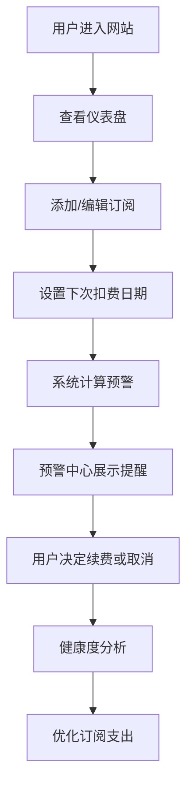

# 订阅管理工具 - 产品需求文档

## 1. 产品概述

订阅管理工具是一款帮助用户管理各类付费订阅服务的网站，解决人们忘记取消自动付费而产生不必要支出的痛点。用户可以录入自己的所有订阅服务，系统会在扣费前发送提醒，帮助用户掌控订阅支出。

- **核心问题**：用户经常忘记取消自动续费订阅，导致不必要的费用支出
- **目标用户**：拥有多个数字订阅服务的都市白领、内容消费者
- **产品价值**：集中管理所有订阅，提前预警扣费，帮助用户节省开支

## 2. 核心功能

### 2.1 用户角色

| 角色 | 注册方式 | 核心权限 |
|------|----------|----------|
| 普通用户 | 无需注册（本地存储演示版） | 管理订阅、查看仪表盘、设置预警 |

### 2.2 功能模块

1. **仪表盘**：月度支出总览、活跃订阅统计、近期扣费列表
2. **订阅管理**：订阅的增删改查，包含服务名称、金额、周期、日期、分类、状态
3. **预警中心**：扣费预警列表、预警天数设置
4. **健康度分析**：分类支出占比饼图、6个月支出趋势折线图

### 2.3 页面详情

| 页面名称 | 模块名称 | 功能描述 |
|-----------|-------------|---------------------|
| 仪表盘 | 统计卡片 | 本月总支出、活跃订阅数、本月新增订阅 |
| 仪表盘 | 即将扣费列表 | 按下次扣费日期排序，显示最近即将扣费的订阅 |
| 订阅管理 | 订阅列表 | 展示所有订阅，支持搜索和分类筛选 |
| 订阅管理 | 新增/编辑订阅 | 表单录入订阅信息：名称、金额、周期、日期、分类、状态 |
| 订阅管理 | 删除订阅 | 确认删除不再使用的订阅 |
| 预警中心 | 预警列表 | 显示距离扣费 X 天内的所有订阅 |
| 预警中心 | 预警设置 | 设置提前预警天数（如3天、7天） |
| 健康度分析 | 分类占比图表 | 饼图展示各类别的订阅支出占比 |
| 健康度分析 | 支出趋势图表 | 折线图展示过去6个月的订阅支出趋势 |

## 3. 核心流程

### 3.1 主要用户流程

用户进入网站后，首先看到仪表盘，了解当前订阅概况。用户可以进入订阅管理页面添加新订阅，设置下次扣费日期。系统根据预警设置，在预警中心展示即将扣费的订阅。用户可通过健康度分析页面了解自己的消费习惯，优化订阅支出。

## 4. 用户界面设计

### 4.1 设计风格

- **设计方向**：极简金融风格，专业可信
- **主色调**：深海军蓝 (#0F172A) - 传达专业、可靠
- **强调色**：翡翠绿 (#10B981) - 表示节省、积极；警示橙 (#F59E0B) - 表示预警
- **中性色**：石板灰系列 (Slate) - 用于文字和背景层次
- **按钮风格**：圆角中等 (rounded-lg)，悬停有微妙阴影和颜色变化
- **字体**：Space Grotesk（标题）+ Inter（正文）- 现代、清晰、专业
- **布局风格**：卡片式布局，侧边导航 + 主内容区
- **图标风格**：Lucide 线性图标，简洁统一

### 4.2 页面设计概览

| 页面名称 | 模块名称 | UI 元素 |
|-----------|-------------|----------|
| 仪表盘 | 统计卡片 | 大数字展示、渐变色卡片、图标装饰 |
| 仪表盘 | 订阅列表 | 表格布局、状态标签、日期高亮 |
| 订阅管理 | 表单弹窗 | 模态框、表单验证、下拉选择 |
| 预警中心 | 预警卡片 | 橙色警示条、倒计时天数、操作按钮 |
| 健康度分析 | 图表区域 | 响应式图表、图例交互、渐变填充 |

### 4.3 响应式设计

- 桌面端（>1024px）：侧边栏导航 + 多列布局
- 平板端（768-1024px）：顶部导航 + 双列布局
- 移动端（<768px）：底部导航 + 单列布局，卡片堆叠

### 4.4 动效设计

- 页面加载：卡片淡入上移，stagger 延迟
- 悬停：卡片轻微上浮 + 阴影增强
- 数据更新：数字滚动动画
- 导航切换：平滑过渡
