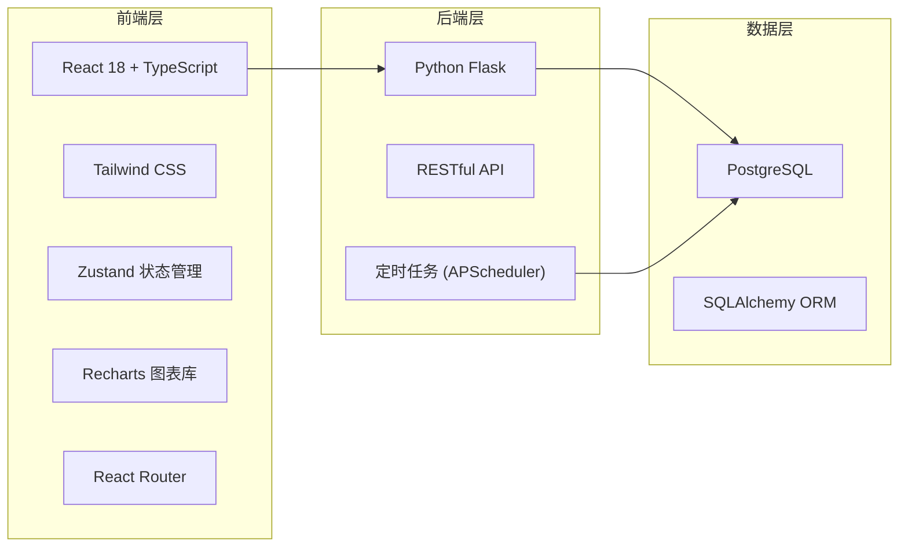
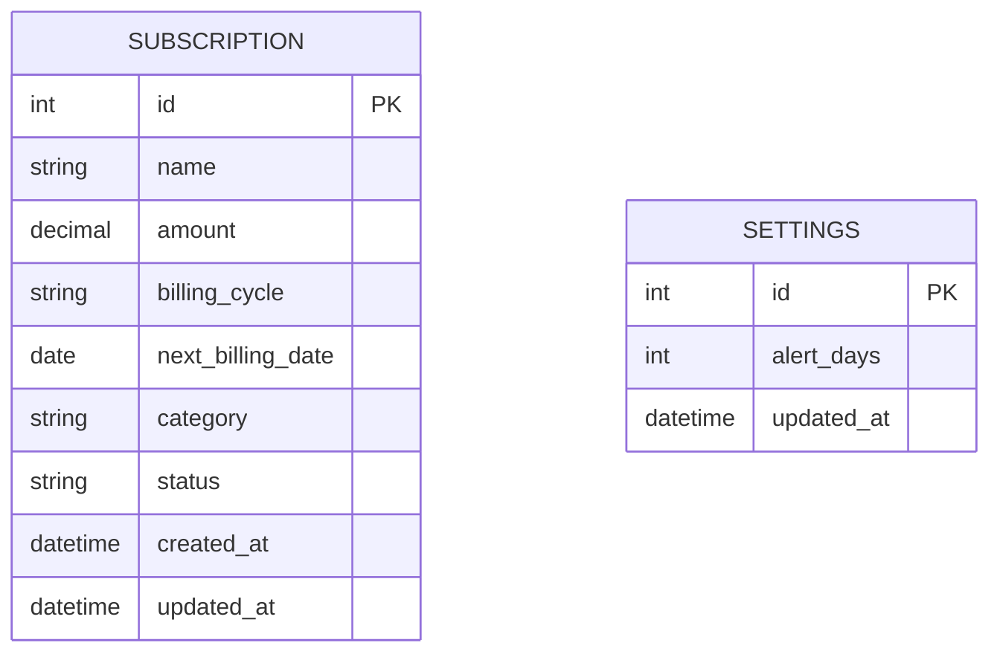

# 订阅管理工具 - 技术架构文档

## 1. 架构设计



## 2. 技术说明

- **前端**：React 18 + TypeScript + Tailwind CSS 3 + Vite
- **初始化工具**：Vite
- **状态管理**：Zustand
- **路由**：React Router DOM 6
- **图表**：Recharts
- **图标**：Lucide React
- **后端**：Python 3.10 + Flask 3
- **ORM**：SQLAlchemy 2
- **定时任务**：APScheduler
- **数据库**：PostgreSQL 15
- **数据迁移**：Alembic

## 3. 路由定义

| 路由 | 页面 | 说明 |
|-------|------|------|
| /dashboard | 仪表盘 | 首页，展示统计概览和即将扣费列表 |
| /subscriptions | 订阅管理 | 订阅的增删改查 |
| /alerts | 预警中心 | 扣费预警和预警设置 |
| /analytics | 健康度分析 | 分类占比和支出趋势图表 |

## 4. API 定义

### 4.1 订阅管理 API

#### 订阅类型定义

```typescript
interface Subscription {
  id: number;
  name: string;
  amount: number;
  billing_cycle: 'monthly' | 'quarterly' | 'yearly' | 'weekly';
  next_billing_date: string;
  category: string;
  status: 'active' | 'paused' | 'cancelled';
  created_at: string;
  updated_at: string;
}
```

#### 接口列表

| 方法 | 路径 | 说明 | 请求体 | 响应 |
|------|------|------|--------|------|
| GET | /api/subscriptions | 获取所有订阅 | - | Subscription[] |
| GET | /api/subscriptions/:id | 获取单个订阅 | - | Subscription |
| POST | /api/subscriptions | 创建订阅 | Omit<Subscription, 'id' | Subscription |
| PUT | /api/subscriptions/:id | 更新订阅 | Partial<Subscription> | Subscription |
| DELETE | /api/subscriptions/:id | 删除订阅 | - | { success: boolean } |
| GET | /api/subscriptions/upcoming?days=7 | 获取即将扣费的订阅 | - | Subscription[] |

### 4.2 统计 API

| 方法 | 路径 | 说明 | 响应 |
|------|------|------|------|
| GET | /api/stats/summary | 获取月度统计概览 | { total_monthly: number; active_count: number; upcoming_count: number } |
| GET | /api/stats/by-category | 按分类统计支出 | { category: string; amount: number; percentage: number }[] |
| GET | /api/stats/trend?months=6 | 支出趋势 | { month: string; amount: number }[] |

### 4.3 设置 API

| 方法 | 路径 | 说明 | 请求体 | 响应 |
|------|------|------|--------|------|
| GET | /api/settings | 获取设置 | - | { alert_days: number } |
| PUT | /api/settings | 更新设置 | { alert_days: number } | { alert_days: number } |

## 5. 服务端架构图

```mermaid
flowchart TD
    A["API Routes (app.py) --> B["Service Layer (services/)"]
    B --> C["Repository Layer (repositories/)"]
    C --> D["SQLAlchemy Models (models/)"]
    D --> E["PostgreSQL Database"]
    
    F["APScheduler (tasks/)"] --> B
    F --> G["预警通知逻辑"]
```

## 6. 数据模型

### 6.1 数据模型定义



### 6.2 DDL 语句

```sql
-- 订阅表
CREATE TABLE subscriptions (
    id SERIAL PRIMARY KEY,
    name VARCHAR(100) NOT NULL,
    amount DECIMAL(10, 2) NOT NULL,
    billing_cycle VARCHAR(20) NOT NULL DEFAULT 'monthly',
    next_billing_date DATE NOT NULL,
    category VARCHAR(50) NOT NULL,
    status VARCHAR(20) NOT NULL DEFAULT 'active',
    created_at TIMESTAMP DEFAULT CURRENT_TIMESTAMP,
    updated_at TIMESTAMP DEFAULT CURRENT_TIMESTAMP
);

CREATE INDEX idx_subscriptions_next_billing_date ON subscriptions(next_billing_date);
CREATE INDEX idx_subscriptions_status ON subscriptions(status);
CREATE INDEX idx_subscriptions_category ON subscriptions(category);

-- 设置表
CREATE TABLE settings (
    id SERIAL PRIMARY KEY,
    alert_days INTEGER NOT NULL DEFAULT 7,
    updated_at TIMESTAMP DEFAULT CURRENT_TIMESTAMP
);

INSERT INTO settings (id, alert_days) VALUES (1, 7) ON CONFLICT (id) DO NOTHING;

-- 初始示例数据
INSERT INTO subscriptions (name, amount, billing_cycle, next_billing_date, category, status) VALUES
('Netflix', 68.00, 'monthly', CURRENT_DATE + INTERVAL '3 days', '娱乐', 'active'),
('Spotify', 15.00, 'monthly', CURRENT_DATE + INTERVAL '10 days', '音乐', 'active'),
('Adobe Creative Cloud', 888.00, 'yearly', CURRENT_DATE + INTERVAL '45 days', '工具', 'active'),
('iCloud+', 21.00, 'monthly', CURRENT_DATE + INTERVAL '5 days', '工具', 'active'),
('哔哩哔哩', 148.00, 'yearly', CURRENT_DATE + INTERVAL '60 days', '娱乐', 'active'),
('Notion', 96.00, 'yearly', CURRENT_DATE + INTERVAL '20 days', '效率', 'active'),
('GitHub Pro', 40.00, 'monthly', CURRENT_DATE + INTERVAL '2 days', '工具', 'active'),
('微信读书', 19.00, 'monthly', CURRENT_DATE + INTERVAL '15 days', '阅读', 'active'),
('京东 Plus', 99.00, 'yearly', CURRENT_DATE + INTERVAL '90 days', '购物', 'paused'),
('ChatGPT Plus', 140.00, 'monthly', CURRENT_DATE + INTERVAL '7 days', '工具', 'active');
```

## 7. 项目结构

```
项目根目录/
├── frontend/                 # 前端项目
│   ├── src/
│   │   ├── components/        # 公共组件
│   │   ├── pages/             # 页面组件
│   │   ├── store/           # Zustand store
│   │   ├── utils/             # 工具函数
│   │   ├── types/             # 类型定义
│   │   ├── App.tsx
│   │   └── main.tsx
│   ├── package.json
│   ├── tailwind.config.js
│   └── vite.config.ts
├── backend/                  # 后端项目
│   ├── app.py
│   ├── models/
│   ├── routes/
│   ├── services/
│   ├── tasks/
│   ├── requirements.txt
│   └── config.py
├── migrations/               # 数据库迁移
└── README.md
```
